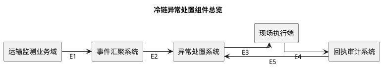
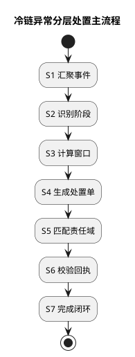

# 一种冷链运输异常分层处置方法/系统

## 基本信息

### 申请说明

1. 现状问题：现有处置流程按单点温度阈值逐条派发，同一运输阶段内的短时波动和持续异常会形成多张任务，且回执材料分散。
2. 本方案机制：在不改变设备采集频率的约束下，按运输阶段维护异常窗口，将窗口结果固化为带责任域和回执约束的分层处置单。
3. 可观察结果：同一运输单在同一阶段窗口内最多保留一张活动处置单，关闭时必须具备结构化触发依据、责任依据和回执证据；当前尚无实测数据，以下结果为预期可观察。

## 提案内容

### 术语解释

1. **温控事件**：附带运输单、箱体和阶段上下文的一次温度采样记录。
2. **阶段化异常窗口**：在当前运输阶段内累计温度偏离量和持续时间的观察区间；切换阶段时按新阶段约束重新计算。
3. **分层处置单**：由同一阶段窗口内相关事件形成的处置对象，同时携带风险等级、责任域和回执要求。
4. **责任域映射**：依据运输节点、执行关系和端点归属确定处置责任方的映射机制。
5. **回执证据约束**：关闭处置单前必须满足的结构化证据字段和时限条件。

### 关键词

- 技术对象：分层处置单
- 核心机制：阶段化异常窗口、责任域映射、回执证据约束
- 关键约束：采集频率保持

### 应用本方案的产品

暂无明确产品或项目，计划在所述冷链运输场景验证，时间待定。

### 本方案的背景是什么

1. 现有问题事实：现有流程按单点阈值逐条派发，短时波动与持续异常被等价处理，会在同一运输阶段形成重复任务。
2. 现有问题事实：温度、轨迹和现场动作已有采集记录，但缺少贯穿判定、派发和回执的统一处置对象。
3. 使用场景：冷链运输在途阶段发生连续温度偏离，需要在不改变设备采集频率的前提下完成异常识别、责任派发和回执闭环。
4. 系统边界：运输监测业务域提供事件；事件汇聚、异常处置和回执审计分别由独立系统承担；现场执行端只接收任务并提交证据。
5. 必要约束：方案不能改变设备采集频率，且需要复用既有工单接口，因此窗口聚合和证据校验必须在服务端完成。

### 行业内哪些竞争对手的业务、产品和本方案相关？请列出竞争对手的名称和相关业务、产品的名称（如有多个请一并列出）

检索范围：分层处置单 阶段化异常窗口 cold chain monitoring real-time temperature platform Tive Sensitech official；阶段化异常窗口 分层处置单 cold chain anomaly alert workflow assignment audit trail official
检索日期：2026-08-09
检索结论：官方页面可确认 Tive 与 Sensitech 均提供冷链运输监控和告警能力；所查页面未直接说明按运输阶段聚合异常、责任域派发及回执证据闭环，因此仅作为相关行业方案，不据此断言其不具备上述能力。
- 名称：Tive；相关业务或产品：Cold Chain Monitoring；实时监测温度、湿度、光照和位置，并提供越界告警与运输记录；来源：https://www.tive.com/solutions/cold-chain-monitoring；检索日期：2026-08-09；证据属性：公开事实
- 名称：Sensitech；相关业务或产品：SensiWatch Platform；提供端到端实时供应链可视性、告警和可行动洞察；来源：https://www.sensitech.com/en/products/sensiwatch-platform/；检索日期：2026-08-09；证据属性：公开事实

### 本方案是否有敏感的部分不适合作为专利申请公开？

无。

### 详细介绍与本方案相似的方案及其缺点

1. **单点阈值逐条派发**：既有方案每次越界都可形成独立任务，无法保证同一阶段窗口只保留一张活动处置单。
2. **判定记录与回执分开保存**：既有方案缺少统一处置对象，关闭任务时无法直接核对触发依据、责任依据和现场证据是否属于同一次处置。

### 详细描述本方案，包括组合部分、步骤

#### 核心发明主张

本方案在保持设备采集频率并复用既有工单接口的约束下，以运输阶段为边界聚合异常事件，形成同时固化判定依据、责任域和回执要求的分层处置单。

该主张区别于单点越界逐条派发且判定记录与回执分离的方案。

#### D1 组件总览及边界职责

<!-- diagram-id: D1 -->

1. **运输监测业务域**：提供带运输单、箱体和阶段上下文的温控事件，不承担处置判定。
2. **事件汇聚系统**：完成多源事件对齐并向异常处置系统提供同一运输对象的有序事件流。
3. **异常处置系统**：维护阶段化异常窗口、生成分层处置单并依据责任域派发。
4. **现场执行端**：接收处置任务并提交结构化现场动作与恢复信息。
5. **回执审计系统**：按处置单约束检查证据完整性，并把审计结论返回异常处置系统。
6. **E1–E5**：E1 表示监测事件输入，E2 表示有序事件流，E3 表示处置任务，E4 表示回执证据，E5 表示审计结论。

#### D2 主流程

<!-- diagram-id: D2 -->

1. **S1 汇聚事件**：事件汇聚系统按运输单和箱体对齐温度、轨迹与现场状态，保留设备原始采样频率。
2. **S2 识别阶段**：异常处置系统根据节点状态识别当前运输阶段，并装载该阶段的窗口参数。
3. **S3 计算窗口**：系统在阶段边界内累计偏离量和持续时间；瞬时波动保留观察，持续异常进入处置判定。
4. **S4 生成处置单**：达到阶段约束时，系统把同一窗口内相关事件聚合为一张活动处置单，并固化触发依据。
5. **S5 匹配责任域**：系统按运输节点、执行关系和端点归属确定责任方，通过既有工单接口派发任务。
6. **S6 校验回执**：现场执行端提交动作、恢复时间和温度曲线；回执审计系统按处置单约束检查字段与时限。
7. **S7 完成闭环**：证据满足约束时关闭处置单；不满足时保留活动状态并返回缺失项，不伪造闭环结果。

#### 创新机制落点

1. I1 落在 S2–S4：阶段边界约束窗口计算，同一窗口的事件只形成一张活动处置单。
2. I2 落在 S5–S7 以及 E3–E5：责任依据和回执证据随同一处置对象传递并接受关闭校验。

### 是否还有其他解决方案，如有，请详细说明

拟扩展保护已在对应创新点下高亮列出，本节不重复。

### 技术效果总结

1. **T1（对应 I1）**：原问题：同一阶段的多次越界形成重复任务。采用机制：阶段化异常窗口聚合同一窗口内相关事件，并约束只保留一张活动处置单。可观察结果：按运输单和阶段窗口统计的活动处置单数量不超过一。验证状态：预期可观察。
2. **T2（对应 I2）**：原问题：判定依据、责任记录和回执材料分散。采用机制：责任域映射与回执证据约束随同一处置单传递并在关闭前校验。可观察结果：每张已关闭处置单均包含触发依据、责任依据和规定证据字段。验证状态：预期可观察。

### 提炼本方案的关键技术创新点

#### I1 阶段窗口驱动处置对象形成

- **已实现基础**
  - 技术对象：分层处置单
  - 触发或输入：同一运输阶段内连续产生的温度异常事件
  - 实际处理：按运输阶段维护异常窗口，并把窗口内相关事件聚合到同一活动处置单
  - 必要边界：不改变设备采集频率，且同一窗口只保留一张活动处置单
  - 输出或状态：形成带阶段边界和事件集合的活动处置单
- 对比基线：现有做法按单条温度越界记录分别形成处置任务。
- 本方案处理方式：按运输阶段维护异常窗口，并把窗口结果固化为分层处置单。
- 必要约束：不改变设备采集频率，且同一窗口只保留一张活动处置单。
- 实质差异：处置对象从单条越界记录变为受阶段边界约束的事件集合。
- 价值关联（T1）：由于同一阶段窗口内的相关事件被固化到同一处置对象，因此可以避免同一窗口产生多张活动处置单。
- 对应可观察结果：按运输单和阶段窗口统计的活动处置单数量不超过一。
- 正文与图示落点：S2、S3、S4 和 D2。

> **拟扩展保护**
>
> - 保护范围：将固定运输阶段窗口扩展为同时受阶段和近期波动范围约束的组合窗口
> - 扩展理由：扩展后仍以窗口边界聚合相关事件并约束单窗口单活动处置单

#### I2 责任与证据同对象闭环

- **已实现基础**
  - 技术对象：分层处置单
  - 触发或输入：异常窗口完成判定并进入责任派发
  - 实际处理：将责任域映射结果和回执证据要求写入同一处置单并在关闭前校验
  - 必要边界：复用既有工单接口，且关闭前必须通过规定证据校验
  - 输出或状态：形成同时包含判定依据、责任依据和回执状态的已关闭处置单
- 对比基线：现有做法将异常判定、责任记录和回执材料分散保存并在事后拼接。
- 本方案处理方式：把责任域映射结果和回执证据约束写入同一处置单。
- 必要约束：复用既有工单接口，且关闭前必须通过证据校验。
- 实质差异：判定、责任和回执不再由分散记录事后拼接。
- 价值关联（T2）：由于判定依据、责任依据和回执要求随同一处置单传递并校验，因此已关闭处置单可以直接核对三类依据是否齐备。
- 对应可观察结果：每张已关闭处置单均包含触发依据、责任依据和规定证据字段。
- 正文与图示落点：S5、S6、S7、E3、E4 和 E5。

> **拟扩展保护**
>
> - 保护范围：将单一责任域映射扩展为带人工确认的候选责任集合
> - 扩展理由：扩展后确认结果仍写回同一处置单并参与关闭前证据校验
